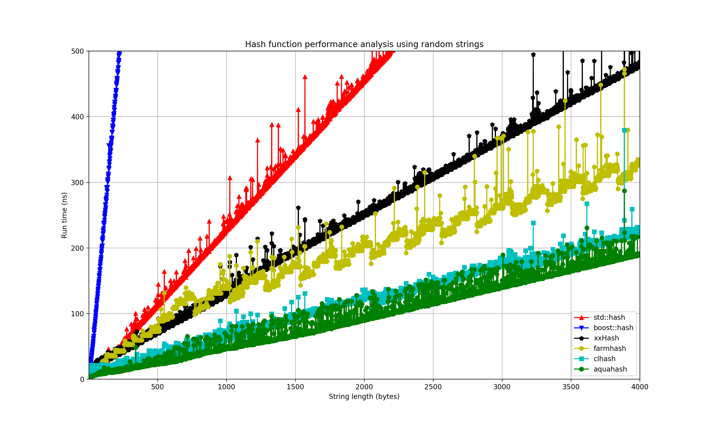
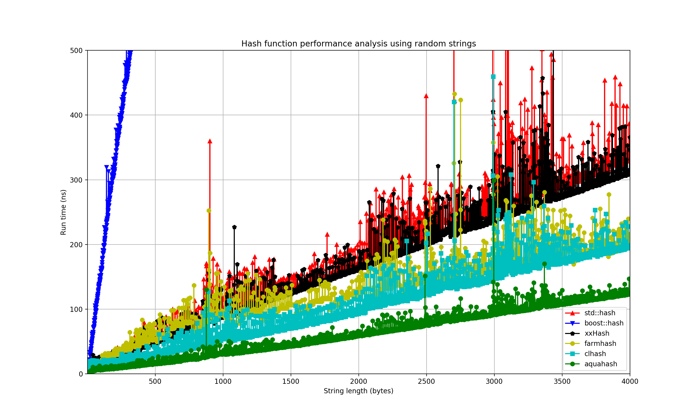

# Introduction #

# How to #

### Compile the benchmark code ###

I have a hard time compile the code using GNU gcc, try clang if you do not want to see [misterious error messages](https://github.com/jandrewrogers/AquaHash/issues/1).

**Download the source code**

``` shell
git clone https://github.com/hungptit/AquaHash.git
```

**Compile all required libraries and binaries**

``` shell
cd AquaHash
./build.sh
```

**Plot the results**

``` shell
./plot_benchmark_results.py data/Darwin/string/data_ 4000 500
```

# Experiment setup #

## Test environments ##

### Linux ###

**CPU**
``` shell
Run on (88 X 2200.08 MHz CPU s)
CPU Caches:
  L1 Data 32K (x44)
  L1 Instruction 32K (x44)
  L2 Unified 256K (x44)
  L3 Unified 56320K (x2)
```

**Compiler**: clang-8.0.0

### MacOS ###

**CPU**

``` shell
Run on (8 X 2200 MHz CPU s)
CPU Caches:
  L1 Data 32K (x4)
  L1 Instruction 32K (x4)
  L2 Unified 262K (x4)
  L3 Unified 6291K (x1)
```

**Compiler**: clang-8.0.0

## Test data ##

### Hash functions ###

This benchmark will generate a random string then collect the performance benchmark results for each hash functions. The output data will be stored in JSON format. 

### Hash table ###

This benchmark will use a hash table to construct a hash set from randomly generated strings.

# Results #

## Linux ##

### Short string benchmarks ###

 

**Analysis**
* AquaHash is the fastest hash function for small keys with the average speed about 4 bytes/cycle. 
* farmhash has a very good performance and its performance is jumped for when the string size is divisible by 32.
* boost::hash is the worse hash function and it is significantly slower than other hash functions.

### Large string benchmarks ###

 

**Analysis**
* The performance of most hash functions is linear to the size of test strings.
* AquaHash is still the fastest hash function. It can process 10 bytes/cycle.
* clhash is the second best hash function.
* boost::hash and std::hash are slowest hash functions from our benchmark.

## MacOS ##

### Short string benchmarks ###

 

**Analysis**
* AquaHash is still the fastest hash function. It can process 10bytes/cycle for strings that a longer than 64 bytes. 
* clhash is the second best hash function for string length greater than 96 bytes. Note that clhash is slow for small strings because its is optimized for large input strings. 
* farmhash is the second best hash function for strings that are less than 96 bytes.

### Large string benchmarks ###

 

**Analysis**
* AquaHash is the fastest hash function in this benchmark and it can process about 15bytes/cycle.
* clhash is still the second best hash function for large strings, however, it is still 60% slower than AquaHash from our benchmark.
* boost::hash is still the worse hash function in this benchmark. It is about 50x slower than AquaHash.

<!-- ## Window Linux Subsystem ## -->

<!-- **Short string benchmarks** -->

<!--   -->

<!-- **Large string benchmarks** -->

<!--   -->

## aquahash command benchmark ##

This benchmark will compare the runtime of aquahash command with other popular commands for computing checksum. Specifically, we will compare the performance of quahash with xxhsum64, md5sum, sha1sum, sha224sum, sha256sum, sha512sum.

### Small files i.e some KB ###

``` shell

```

### Medium files i.e 1MB or above ###

``` shell

```

### Large files i.e 100MB or above ###

``` shell

```

# Other observations #

* The performance of all hash functions is consistent in all platforms.

* farmhash is the worse in-term of usability. We cannot compile farmhash using provided configure script and have to use it as a header only library.

* aquahash is not compilable using GNU gcc and users must use clang to compile AquaHash code.

* std::hash does not take raw pointers and length. We need to use std::string when comparing the performance of all studied hash functions.

