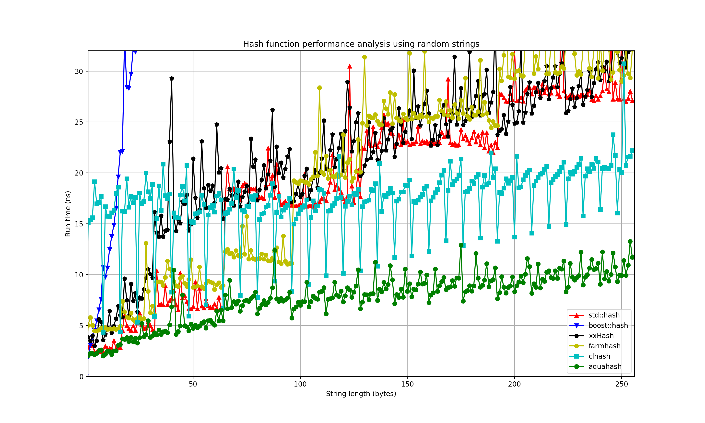

# Introduction #

# How to #

### Compile the benchmark code ###

I have a hard time compile the code using GNU gcc, try clang if you do not want to see [misterious error messages](https://github.com/jandrewrogers/AquaHash/issues/1).

**Download the source code**

``` shell
git clone -r https://github.com/hungptit/AquaHash.git
```

**Compile all required libraries and binaries**

``` shell
cd AquaHash
./build.sh
```

**Plot the results**

``` shell
./plot_benchmark_results.py data/Darwin/string/data_ 4000 500
```

# Experiment setup #

## Test environments ##

### Linux ###

**CPU**
``` shell
Run on (88 X 2200.08 MHz CPU s)
CPU Caches:
  L1 Data 32K (x44)
  L1 Instruction 32K (x44)
  L2 Unified 256K (x44)
  L3 Unified 56320K (x2)
```

**Compiler**: clang-8.0.0

### MacOS ###

**CPU**

``` shell
Run on (8 X 2200 MHz CPU s)
CPU Caches:
  L1 Data 32K (x4)
  L1 Instruction 32K (x4)
  L2 Unified 262K (x4)
  L3 Unified 6291K (x1)
```

**Compiler**: clang-8.0.0

## Test data ##

### Hash functions ###

This benchmark will generate a random string then collect the performance benchmark results for each hash functions. The output data will be stored in JSON format. 

### Hash table ###

This benchmark will use a hash table to construct a hash set from randomly generated strings.

# Results #

## Linux ##

**Short string benchmarks**

 

**Large string benchmarks**

 

## MacOS ##

**Short string benchmarks**

 

**Large string benchmarks**

 

## Window Linux Subsystem ##

**Short string benchmarks**

 

**Large string benchmarks**

 

